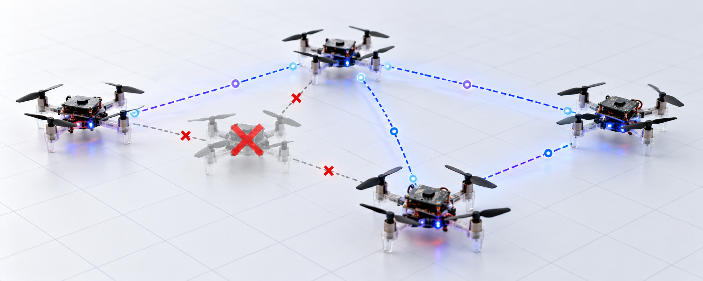

<div align="center">
  <h1>ROS 2 Dynamic Topology Reconfiguration for Crazyflie Swarms</h1>
  <h3>Fault-Tolerant Consensus Formation Control on 3-Drone Crazyflie 2.1 Hardware</h3>

  <p><i>A ROS 2 system implementing closed-loop, bidirectional ring consensus for coordinated circular orbit formation, with real-time motor fault injection and dynamic topology reconfiguration validated on physical Crazyflie 2.1 nano-quadrotors.</i></p>

  <br/>
  
  <p>
    
    
    
    
  </p>
</div>

---

## Benchmarking Overview

This repository validates fault-tolerant consensus formation control across three categories of motor faults on a 3-drone Crazyflie 2.1 swarm. The controller runs a **closed-loop, bidirectional ring phase-consensus algorithm** and recovers formation coherence through dynamic network topology updates that isolate faulty agents.

The swarm performs circular orbit tracking (radius 0.6 m, altitude 0.5 m) for 60 s per experiment. Motor fault injection begins at t = 10 s via the ROS 2 `SetParameters` service on the `crazyflie_server` node, targeting `powerDist.m1Health` on `cf1`.

---

## Experiment Matrix

We ran **15 experiments** across 4 fault scenarios. Each experiment is a single 60 s flight run.

### Summary Table

| Experiment ID | Fault Type | Motor Health After Fault | Fault-Tolerant Topology | Folder |
| :--- | :---: | :---: | :---: | :--- |
| **B1** | None (Baseline) | 1.000 | — | `00_baseline/B1_no_fault/run_1/` |
| **A1** | Abrupt | 0.700 (mild) | — | `01_abrupt_faults/A1_health_0.7/run_1/` |
| **A2** | Abrupt | 0.500 (moderate) | ✗ | `01_abrupt_faults/A2_health_0.5/without_FT/run_1/` |
| **A2** | Abrupt | 0.500 (moderate) | ✓ | `01_abrupt_faults/A2_health_0.5/with_FT/run_1/` |
| **A3** | Abrupt | 0.300 (severe) | ✗ | `01_abrupt_faults/A3_health_0.3/without_FT/run_1/` |
| **A3** | Abrupt | 0.300 (severe) | ✓ | `01_abrupt_faults/A3_health_0.3/with_FT/run_1/` |
| **I1** | Incipient | 0.02/step (slow) | ✗ / ✓ | `02_incipient_faults/I1_slow/` |
| **I2** | Incipient | 0.05/step (medium) | ✗ / ✓ | `02_incipient_faults/I2_medium/` |
| **I3** | Incipient | 0.10/step (fast) | ✗ / ✓ | `02_incipient_faults/I3_fast/` |
| **T1** | Intermittent | 10 s on / 10 s off | — | `03_intermittent_faults/T1_10s_cycle/run_1/` |
| **T2** | Intermittent | 3 s on / 3 s off | — | `03_intermittent_faults/T2_3s_cycle/run_1/` |
| **T3** | Intermittent | 5 s on / 15 s off | — | `03_intermittent_faults/T3_asymmetric/run_1/` |

> **Key Takeaway**: The fault-tolerant topology variant (`with_FT`) maintains formation coherence for `cf2` and `cf3` by excluding the faulty `cf1` from consensus weight updates, significantly reducing mean position divergence under abrupt and incipient faults.

### Fault Types

| Type | Behaviour | Key Parameters |
| :--- | :--- | :--- |
| `none` | No fault injected — nominal formation tracking | — |
| `abrupt` | Motor health instantly set to `fault_magnitude` at `fault_start_delay` | `fault_magnitude`, `fault_motor` |
| `incipient` | Gradual degradation from 1.0 toward `fault_min_health` per `fault_step_interval` | `fault_rate`, `fault_step_interval`, `fault_min_health` |
| `intermittent` | Cyclic health toggling: faulty for `fault_on_time`, healthy for `fault_off_time` | `fault_on_time`, `fault_off_time`, `fault_magnitude` |

---

## How It Works

**State per drone (from Lighthouse + firmware telemetry at 50 Hz):**
Position `(x, y, z)`, velocity `(vx, vy, vz)`, attitude `(roll, pitch, yaw)`, angular rates `(gx, gy, gz)`, motor PWM outputs `(m1–m4)`.

**Ring Consensus Phase Update:**
```
φᵢ(t+dt) = φᵢ(t) + ω·dt  +  k_consensus · Σⱼ∈N(i) wrap(φⱼ - φᵢ - Δᵢⱼ) · dt
```
Where `Δᵢⱼ = 2π/3` (120° desired phase separation), `ω = 0.25 rad/s`, and `k_consensus = 0.08`.

**Fault Injection Mechanism:**
The `SwarmConsensusController` node calls the `crazyflie_server`'s `SetParameters` service at runtime to modify `powerDist.m1Health` — no firmware flashing required. The fault schedule is fully parameterised via ROS 2 launch arguments.

**Topology Reconfiguration:**
When a drone's Kalman-estimated position diverges beyond arena bounds (`|x| > 2.0 m`, `|y| > 2.0 m`, `|z| > 1.5 m`), the guidance node excludes it from consensus weight updates, preventing fault propagation to healthy neighbours.

---

## Project Structure

```text
ROS2_Dynamic_Topology_Reconfiguration/
├── src/                                    # ROS 2 colcon workspace packages
│   ├── central_swarm_control/              # Main consensus + fault-injection controller
│   │   ├── central_swarm_control/
│   │   │   └── control_node.py             # SwarmConsensusController node
│   │   ├── config/
│   │   │   └── crazyflies.yaml             # Drone URIs, firmware logging, motor params
│   │   └── launch/
│   │       └── physical_swarm.launch.py    # Full-system launch with experiment args
│   ├── swarm_guidance/                     # Ring consensus trajectory generator
│   │   └── swarm_guidance/
│   │       └── guidance_node.py            # RingConsensusGuidance node
│   └── swarm_navigation/                   # Telemetry aggregator
│       └── swarm_navigation/
│           └── navigation_node.py          # SwarmNavigationNode (pose + telemetry relay)
├── experiment_logs/                        # Structured flight telemetry data
│   ├── 00_baseline/
│   ├── 01_abrupt_faults/
│   ├── 02_incipient_faults/
│   ├── 03_intermittent_faults/
│   ├── analysis/
│   │   ├── generate_plots.py               # Plot generation from experiment CSVs
│   │   └── visualize_flight.py             # Flight animation video generator
│   ├── plots/                              # Generated figures (per fault type)
│   └── README.md                           # Full experiment matrix + CSV column dict
├── data/
│   └── raw_flight_logs/                    # Raw timestamped CSVs (gitignored)
│       ├── esc_Z11/
│       ├── esc_optimization/
│       ├── figure8/
│       ├── swarm_consensus_fault/
│       └── misc/
├── docs/
│   ├── rosgraph.png                        # ROS topic graph
│   ├── rosgraph_enc.png                    # Encoded ROS topic graph
│   └── paper_draft.md                      # Research manuscript draft
├── build/                                  # Colcon build output (gitignored)
├── install/                                # Colcon install output (gitignored)
├── log/                                    # Colcon logs (gitignored)
└── .gitignore
```

### ROS 2 Topic Graph

| Topic | Message Type | Flow |
| :--- | :--- | :--- |
| `/cfX/pose` | `PoseStamped` | `crazyswarm2` → `navigation` |
| `/cfX/kinematics` | `LogDataGeneric` | `crazyswarm2` → `navigation` |
| `/cfX/attitude_gyro` | `LogDataGeneric` | `crazyswarm2` → `navigation` |
| `/cfX/actuators` | `LogDataGeneric` | `crazyswarm2` → `navigation` |
| `/swarm/state` | `PoseArray` | `navigation` → `guidance` + `control` |
| `/swarm/telemetry` | `Float64MultiArray` | `navigation` → `control` |
| `/swarm/targets` | `PoseArray` | `guidance` → `control` |
| `/cfX/cmd_hover` | `Hover` | `control` → `crazyswarm2` |

---

## Setup & Usage

### Prerequisites

```bash
# ROS 2 Humble or Jazzy
sudo apt-get install -y python3-rosdep python3-colcon-common-extensions

# Python dependencies
pip install cflib numpy scipy pyyaml
```

### Build

```bash
cd <workspace_root>   # this repo root
colcon build --symlink-install
source install/setup.bash

# Install ROS dependencies
rosdep install --from-paths src --ignore-src -r -y
```

### Running Experiments

`physical_swarm.launch.py` is the single entry point for all experiments. All fault parameters are controlled via launch arguments.

```bash
# TC-B1: Baseline — no fault
ros2 launch central_swarm_control physical_swarm.launch.py \
  experiment_id:=B1_no_fault fault_type:=none

# TC-A1: Abrupt fault — motor 1 degraded to 70%
ros2 launch central_swarm_control physical_swarm.launch.py \
  experiment_id:=A1_abrupt_0.7 fault_type:=abrupt \
  fault_motor:=1 fault_magnitude:=0.7 fault_start_delay:=10.0

# TC-A3 (with FT): Severe abrupt fault — motor 1 at 30%, topology reconfiguration enabled
ros2 launch central_swarm_control physical_swarm.launch.py \
  experiment_id:=A3_abrupt_0.3_FT fault_type:=abrupt \
  fault_motor:=1 fault_magnitude:=0.3 fault_start_delay:=10.0

# TC-I2: Incipient fault — gradual degradation, 0.05/step every 5 s
ros2 launch central_swarm_control physical_swarm.launch.py \
  experiment_id:=I2_medium fault_type:=incipient \
  fault_motor:=1 fault_magnitude:=0.7 \
  fault_rate:=0.05 fault_step_interval:=5.0 fault_min_health:=0.5

# TC-T1: Intermittent fault — 10 s on / 10 s off
ros2 launch central_swarm_control physical_swarm.launch.py \
  experiment_id:=T1_10s_cycle fault_type:=intermittent \
  fault_motor:=1 fault_magnitude:=0.5 \
  fault_on_time:=10.0 fault_off_time:=10.0
```

**What happens during a run:**
1. `crazyflie_server` connects to all 3 drones over Crazyradio.
2. `navigation_node` aggregates 50 Hz pose + telemetry from all drones.
3. `guidance_node` runs the ring consensus phase update and publishes target positions.
4. `control_node` issues hover commands and — after `fault_start_delay` seconds — calls `SetParameters` on the server to inject the motor fault.
5. On completion, telemetry CSV and metadata `.txt` are saved under `experiment_logs/<fault_category>/<experiment_id>/run_<N>/`.

### Generating Plots

```bash
# Generate per-experiment IEEE-style figures
cd experiment_logs/analysis
python3 generate_plots.py

# Generate flight animation video
python3 visualize_flight.py
```

Pre-generated plots are stored in `experiment_logs/plots/` organized by fault category.

---

## Key Design Decisions

- **Closed-Loop Phase Consensus**: Rather than tracking a pre-programmed trajectory, each drone's angular phase is updated using live position measurements, making the formation robust to individual drone latency or position drift.
- **Bidirectional Ring Topology**: Each drone couples with both ring neighbours (not just one), giving the consensus a symmetric restoring force — equivalent to a second-order phase-locked loop.
- **Crash Detection via Bounds Check**: The Kalman filter on a crashed drone produces wildly divergent position estimates. Excluding any drone whose estimated position exceeds arena bounds (`|x|, |y| > 2 m`, `|z| > 1.5 m`) prevents garbage measurements from corrupting the healthy drones' consensus.
- **Firmware-Level Fault Injection**: Using `powerDist.mXHealth` via the `SetParameters` ROS 2 service injects faults directly into the firmware's motor mixing stage — no firmware flashing, no hardware modification. All fault schedules are reproducible from launch arguments alone.
- **Telemetry at 50 Hz**: Custom `firmware_logging` topics (`kinematics`, `attitude_gyro`, `actuators`) are configured in `crazyflies.yaml` and published via `LogDataGeneric`, giving dense per-step data for offline analysis.

---

## Hardware Setup

| Component | Specification |
| :--- | :--- |
| Drones | Bitcraze Crazyflie 2.1+ × 3 |
| Localization | Lighthouse deck (10+ base stations) |
| Radio | Crazyradio 2.0 (2.4 GHz) |
| Arena | 5 m × 5 m |
| Host OS | Ubuntu 22.04, ROS 2 Humble / Jazzy |
| Control loop | 50 Hz (20 ms) |

---
## Acknowledgments

- [Bitcraze](https://www.bitcraze.io/) — Crazyflie platform and `crazyswarm2`
- IIT Mandi - Research infrastructure and mentorship
- ROS 2 Community

## License

Apache-2.0 - see `LICENSE` for details.
